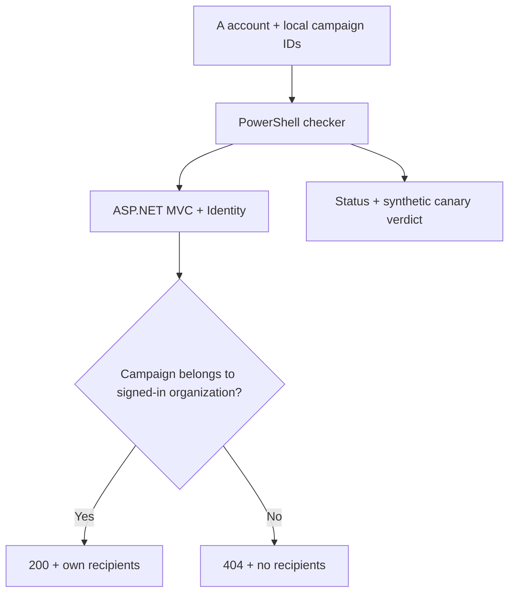

# AidSlot Security Lab — presentation and architecture

Track 3: Offensive Security & Red Teaming. All tests target a participant-owned localhost application and fictional recipients.

## One-sentence pitch

We built a bounded authorization checker that proves whether one aid organization can read another organization's campaign recipients, then verifies that the server-side ownership check blocks it.

## Threat and impact

AidSlot manages aid campaigns and recipient records. In a multi-organization version, a signed-in user could change the numeric campaign ID in a URL. If the server trusted the login alone and did not enforce campaign ownership, that user could read another organization's recipient information. The potential impact is disclosure of personal data and loss of trust. The demonstrated data is synthetic. We have not measured production prevalence or demonstrated an exploit against the original one-organization app.

## Architecture

The checker signs in as synthetic Organization A and requests both A's and B's recipient pages. It reports `VULNERABLE` only when B's unique fictional canary is actually in the returned page. A blocked 403/404 for B plus working 200 for A yields `PROTECTED`. Other responses yield `INCONCLUSIVE`. The protected application checks `OrganizationId` on the server for campaign reads and writes. The opt-in weak mode skips that check on one synthetic read route only, on localhost in Development, to supply a reproducible positive case.

## Demo sequence (target: under 7 minutes)

1. **Problem, 45 seconds:** Two NGOs share an application. A logged-in member of A must never see B's recipient data by changing a campaign ID.
2. **Scope and architecture, 60 seconds:** Show this diagram, the synthetic A/B CSV files, localhost restriction and protected data boundary.
3. **Positive detection, 75 seconds:** In the deliberately weak local mode, run the PowerShell checker. Show A=200, B=200, `ContainsB_Canary=true`, and `VULNERABLE`. Show screenshot `evidence/01-synthetic-cross-org-read.png`.
4. **Remediation and verification, 90 seconds:** Clear the weak-mode switch and restart the app. Show A=200, B=404, `ContainsB_Canary=false`, and `PROTECTED`. Show screenshot `evidence/03-cross-org-404.png`.
5. **Reliability, 60 seconds:** Explain that the first B campaign without the canary returned `INCONCLUSIVE`, not a false finding. An anonymous browser visit redirected to Login; a nonexistent campaign ID returned 404.
6. **Impact and limits, 45 seconds:** The issue would expose recipient data in a multi-organization deployment. The test covers one read route and synthetic local accounts; further routes and role/write testing remain for broader assurance. Disclose pre-existing AidSlot and the deliberate test fixture.

## Evaluation summary

| Case | Observed result | Meaning |
| --- | --- | --- |
| A reads own campaign | 200 in weak and protected modes | Normal function preserved |
| A reads B in weak local mode | 200 with unique B canary | Positive detection |
| A reads B in protected mode | 404 with no B canary | Remediation verified |
| B ID without expected canary | 200 without canary | Inconclusive, avoids false claim |
| Anonymous recipient page | Redirect to Login (manual browser check) | Login boundary observed |
| Nonexistent campaign ID | 404 (manual browser check) | Missing record handled safely |

## Disclosure

AidSlot's campaign, CSV, Identity and check-in features existed before the hackathon. The two-organization boundary, synthetic lab seeder, bounded checker, and evaluation were added during the event. The deliberately weak read path is a disclosed local test fixture. See [SETUP.md](SETUP.md) and [EVALUATION.md](EVALUATION.md) for reproduction and evidence.
